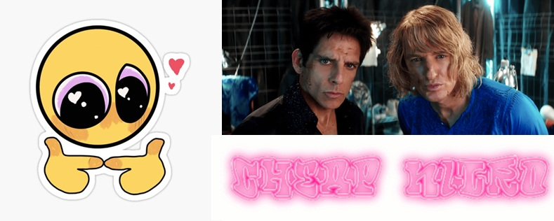

<!-- ================================= -->
<!--            cheapNitro             -->
<!-- ================================= -->

<p align="center">
  
</p>

<h1 align="center">cheapNitro</h1>

<p align="center">
  with ❤️ from <b>pure</b> & AI
</p>

<p align="center">
<i>Why pay for Nitro when you can get bullied by a bot for free?</i>
</p>

<p align="center">
  
</p>

---

## 🤖 What is cheapNitro?

**cheapNitro** is a Discord bot that plays a custom audio clip whenever someone joins a designated voice channel.

It is:

- Slightly unnecessary  
- Mildly chaotic  
- Fully intentional  

---


## 🔊 What It Does


- Admin sets a target voice channel using `!setjoinchannel`
- Bot joins that voice channel
- When a user joins:
  - If not on cooldown
  - If not excluded via role
- The bot plays `join.mp3`

It also:

- 🔁 Reconnects if voice drops  
- 🚪 Leaves when the channel is empty  
- 🧯 Prevents spam during mass-moves  

---

## 📂 Project Structure

```
CHEAPNITRO/
│
├── bot.py
├── join.mp3
├── join_config.json (auto-created)
└── cogs/
    ├── __init__.py
    └── joinsound.py
```

<p align="center">  </p>

---

## ⚙️ Setup

```
1️⃣ Install dependencies
pip install -U discord.py
You must also install FFmpeg and ensure it is available in your system PATH.

2️⃣ Set your bot token
Windows (PowerShell)
$env:DISCORD_TOKEN="YOUR_TOKEN_HERE"
python bot.py
Mac / Linux
export DISCORD_TOKEN="YOUR_TOKEN_HERE"
python bot.py
```

<p align="center">  </p>

---

## 🎵 Audio File Requirements

```
File must be named: join.mp3

Place it in the root folder (same as bot.py)

Recommended:

Length: 1–5 seconds

Format: MP3

Bitrate: 128 kbps

Long audio clips may result in social consequences.
```

## 🛠 Commands

```
!setjoinchannel
Sets the current voice channel as the designated join-sound channel.

Requires Manage Server permission.

!joinchannel
Forces the bot to reconnect to the configured voice channel.

```
## 🧠 Cooldown

```
The bot uses a cooldown to prevent chaos during mass user moves.

Default:

COOLDOWN_SECONDS = 15

Adjust inside:
cogs/joinsound.py

```

## 🚫 Optional

```
Excluding Users (e.g. Nitro users)

Create a role (example: NitroUser)

Enable Developer Mode in Discord

Copy the Role ID

Add it to:

self.EXCLUDED_ROLE_IDS = [ROLE_ID_HERE]
```

## 🧩 Future Expansion Ideas

```
Per-user custom join sounds

Role-based entrance sounds

Random meme sound folder

Sound queue system

Slash command support
```

## ⚠️ Important

```
This bot:

Requires Connect + Speak permissions

Requires FFmpeg installed

Will annoy people if your audio clip is too long

Use responsibly… or irresponsibly. I am not your supervisor.
```

<p align="center">  </p> <p align="center"> <i>cheapNitro — because dignity is optional.</i> </p> 
